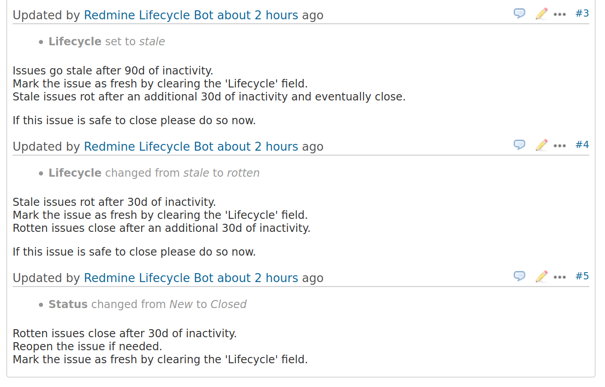

# Redmine Lifecycle Bot

This script implements issue lifecycle management for redmine.
It's inspired by the kubernetes fetja-bot.

The bot is enabled on a per project basis by adding it's api-key owner
as a member. It is recommended to use a dedicated user and api-key.

The bot can then be run once per day from a cronjob.

It takes redmine issues in that project through the following lifecycle:

- after 90 days of inactivity: mark as stale
- after another 30 days of inactivity:
   - if marked as stale, mark as rotten
   - if marked as rotten, close


This is a screenshot showing what this looks like in redmine. Note that the updates would
normaly be done after 90/30/30 days of inactivity.




## Requirements

### Custom field

Create a custom field in redmine with the following properties:

```
Format: List
Name: Lifecycle (or whatever you like)
Possible values: '', 'stale', 'rotten', 'frozen'
Used as a filter: True
```

### API key with admin privileges

You need the API key of a user that has admin privileges.


### ID of a redmine 'Status'

The numeric ID of a redmine status field which has the 'Issue closed' flag.
When issues are rotten this status is used to close them.
This defaults to '5' which is redmine's default 'Closed' status.

## Usage

### Enable

The Bot is enabled for a project by adding the User owning the API key
as a member.


### Run

```
redmine-lifecycle-bot \
  --verbose \
  --dry-run \
  --url https://redmine.example.com \
  --api-key your-api-key \
  --lifecycle-field-id 42 \
  --rotten-status-id 5
```

Or alternatively:

```
export REDMINE_URL='https://redmine.example.com'
export REDMINE_API_KEY='your-api-key'
export LIFECYCLE_FIELD_ID=42
export ROTTEN_STATUS_ID=5

redmine-lifecycle-bot \
  --verbose \
  --dry-run
```

Or as a docker container:

```
podman run -ti --rm \
   -e "REDMINE_URL=https://redmine.example.com" \
   -e "REDMINE_API_KEY=your-api-key" \
   -e "LIFECYCLE_FIELD_ID=42" \
   -e "ROTTEN_STATUS_ID=42" \
   docker.io/asteven/redmine-lifecycle-bot \
      --verbose \
      --dry-run
```

